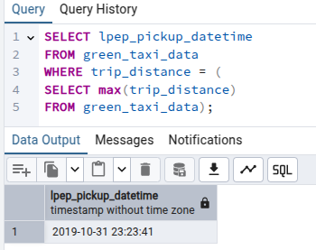
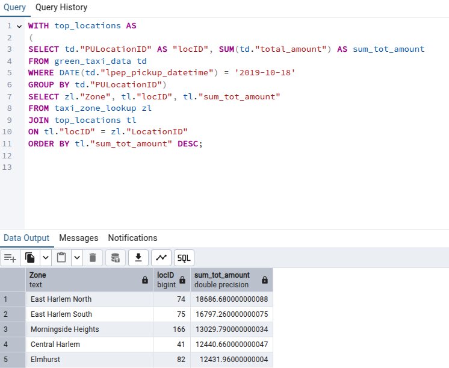
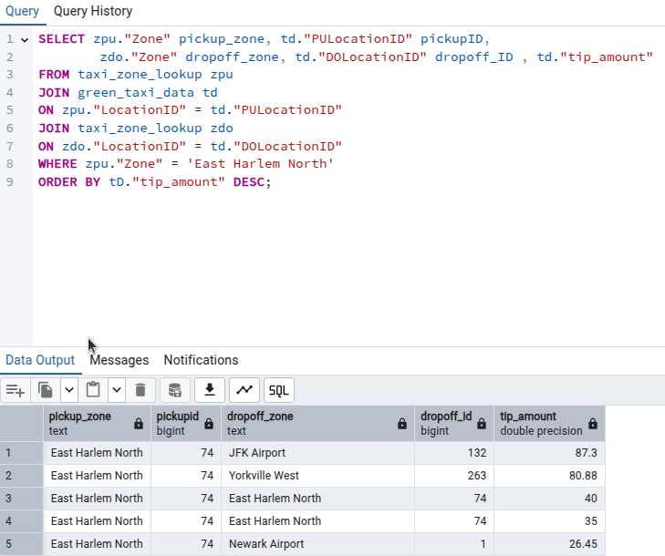

## Module 1 - Homework

### Docker & SQL

#### Question 1 
**Which sub-command does this:** *Remove one or more images* 
$ docker --help

**Answer:**
rmi         Remove one or more images


#### Questions 2
**What's the version of pip in the image**

**Answer:**
```root@80e39b05b31e:/app# pip --version
pip 24.3.1 from /usr/local/lib/python3.12/site-packages/pip (python 3.12)
```

#### Question 3 - Count records
**How many taxi trips were made on Oct 18th 2019?**

Input in pgadmin:
```
SELECT COUNT(*)
FROM green_taxi_data
WHERE lpep_pickup_datetime > '2019-10-18 00:00:00' 
	AND lpep_dropoff_datetime < '2019-10-19 00:00:00';
```
Answer:
```
17417
```

#### Question 4 - Longest trip for each day
**Which was the pickup day with the longest trip distane**




#### Question 5 - Three biggest pickup zones
** Which were the top pickup locations with over 13,000 in total_amount
for day 2019-10-18 ** 



Answer:  
*East Harlem North, East Harlem South, Morningside Heights*

#### Question 6 -Largest trip
**For the passengers picked up in October 2019 in the zone "East Halem North" which was the drop off zone that had the largest tip?** 



Answer:
*JFK Airport*

### Terraform

#### Question 7 - Creating resources

**input:**  
$ terraform apply

**output:**  
```
Terraform used the selected providers to generate the following execution plan. Resource actions are indicated
with the following symbols:
  + create

Terraform will perform the following actions:

  # google_bigquery_dataset.dezc2025-dataset will be created
  + resource "google_bigquery_dataset" "dezc2025-dataset" {
      + creation_time              = (known after apply)
      + dataset_id                 = "dezc2025_bq_dataset"
      + default_collation          = (known after apply)
      + delete_contents_on_destroy = false
      + effective_labels           = {
          + "goog-terraform-provisioned" = "true"
        }
      + etag                       = (known after apply)
      + id                         = (known after apply)
      + is_case_insensitive        = (known after apply)
      + last_modified_time         = (known after apply)
      + location                   = "US"
      + max_time_travel_hours      = (known after apply)
      + project                    = "de-zoomcamp2025"
      + self_link                  = (known after apply)
      + storage_billing_model      = (known after apply)
      + terraform_labels           = {
          + "goog-terraform-provisioned" = "true"
        }

      + access (known after apply)
    }

  # google_storage_bucket.dezc2025-bucket will be created
  + resource "google_storage_bucket" "dezc2025-bucket" {
      + effective_labels            = {
          + "goog-terraform-provisioned" = "true"
        }
      + force_destroy               = true
      + id                          = (known after apply)
      + location                    = "EU"
      + name                        = "dezc2025-bucket_prj639804374698"
      + project                     = (known after apply)
      + project_number              = (known after apply)
      + public_access_prevention    = (known after apply)
      + rpo                         = (known after apply)
      + self_link                   = (known after apply)
      + storage_class               = "STANDARD"
      + terraform_labels            = {
          + "goog-terraform-provisioned" = "true"
        }
      + uniform_bucket_level_access = (known after apply)
      + url                         = (known after apply)

      + lifecycle_rule {
          + action {
              + type          = "AbortIncompleteMultipartUpload"
                # (1 unchanged attribute hidden)
            }
          + condition {
              + age                    = 1
              + matches_prefix         = []
              + matches_storage_class  = []
              + matches_suffix         = []
              + with_state             = (known after apply)
                # (3 unchanged attributes hidden)
            }
        }

      + soft_delete_policy (known after apply)

      + versioning (known after apply)

      + website (known after apply)
    }

Plan: 2 to add, 0 to change, 0 to destroy.

Do you want to perform these actions?
  Terraform will perform the actions described above.
  Only 'yes' will be accepted to approve.

  Enter a value: yes

google_bigquery_dataset.dezc2025-dataset: Creating...
google_storage_bucket.dezc2025-bucket: Creating...
google_bigquery_dataset.dezc2025-dataset: Creation complete after 1s [id=projects/de-zoomcamp2025/datasets/dezc2025_bq_dataset]
google_storage_bucket.dezc2025-bucket: Creation complete after 2s [id=dezc2025-bucket_prj639804374698]
```


